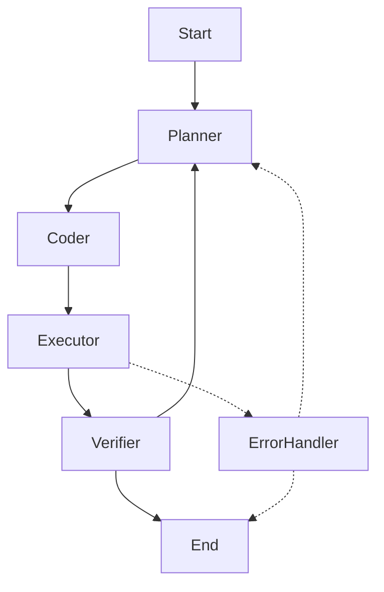

# AutoWeb (LangGraph V2 Edition)

> 自动化浏览器代理，基于 LangGraph V2 架构重构，支持持久化记忆、断点续传与 Human-in-the-Loop。

## 🚀 新架构特性 (V2)

- **Pure Graph Architecture**: 摒弃了旧的状态机模式，采用 LangGraph 标准图结构。
- **Command-Based Routing**: 节点间通过 `Command` 对象进行动态声明式路由 
- **Persistence**: 集成 `MemorySaver` (可扩展为 SQLite/Postgres)，支持会话状态保存与回滚。
- **Human-in-the-Loop**: 关键操作 (如代码执行) 前自动暂停，支持人工审批。
- **Resiliency**: 内置全局 `ErrorHandler` 节点，崩溃时尝试自动恢复。

## 📂 核心目录结构

- `core/graph_v2.py`:  Graph 定义入口 (含 Checkpointer 与 Interrupts 配置)
- `core/nodes.py`:     纯函数节点实现 (Planner / Coder / Executor / Verifier)
- `core/state_v2.py`:  AgentState 类型定义 (含 Reducers)
- `core/tools.py`:     标准化 Tool 封装 (DOMAnalysis / Click / Navigate)
- `test/test_graph_v2.py`: 架构验证脚本

## 🛠️ 使用方法 (开发中)

```python
from core.graph_v2 import build_graph
from langgraph.checkpoint.memory import MemorySaver

# 1. 初始化
memory = MemorySaver()
graph = build_graph(checkpointer=memory)

# 2. 运行
config = {"configurable": {"thread_id": "session_1", "browser": driver}}
graph.stream({"user_task": "打开百度搜索 AI"}, config=config)
```

## 🔄 状态流转图


