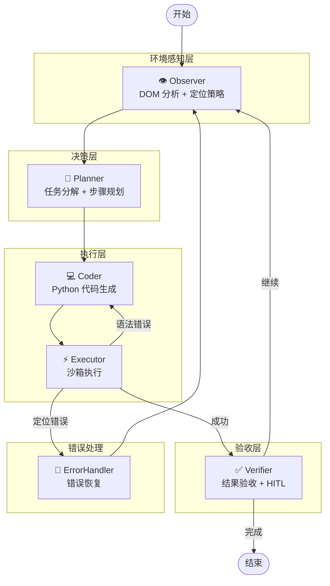

# 🌐 AutoWeb - 智能网页自动化 Agent

> 基于 LangGraph 的多节点协作 AI Agent，能够理解自然语言指令，自动规划、执行复杂的网页操作任务。


## ✨ 核心特性

| 特性 | 描述 |
|------|------|
| 🧠 **多节点协作** | Observer → Planner → Coder → Executor → Verifier 流水线架构 |
| 🔄 **Command Pattern** | 节点返回 `Command(goto="NextNode")` 实现动态路由 |
| 👁️ **环境感知** | DOM 骨架压缩 + Hash 变化检测，智能跳过无变化页面 |
| 🛡️ **错误恢复** | Executor 微循环（语法错误重试）+ ErrorHandler 全局兜底 |
| 🧑‍💻 **Human-in-the-Loop** | 关键操作前暂停，支持人工审批、编辑代码、覆盖验收结果 |
| 💾 **状态持久化** | 基于 MemorySaver 的检查点机制，支持断点续传 |
| 🔧 **依赖注入** | 使用 `functools.partial` 预绑定 LLM/Observer，便于测试 |

## 🏗️ 架构设计



## 📂 目录结构

```
AutoWeb/
├── main.py                 # 主入口（交互循环 + HITL 处理）
├── config.py               # 配置（LLM API、模型参数）
├── core/
│   ├── graph_v2.py         # LangGraph 图构建
│   ├── nodes.py            # 节点实现（Observer/Planner/Coder/Executor/Verifier）
│   └── state_v2.py         # AgentState 类型定义 + Reducers
├── skills/
│   ├── observer.py         # BrowserObserver（DOM 分析、定位策略生成）
│   ├── actor.py            # 代码执行器（沙箱环境）
│   └── toolbox.py          # 工具箱（save_data/download_file/http_request）
├── prompts/
│   ├── action_prompts.py   # Coder Prompt（代码生成规则）
│   ├── planner_prompts.py  # Planner Prompt（规划策略）
│   └── dom_prompts.py      # DOM 分析 Prompt
├── drivers/
│   └── drission_driver.py  # DrissionPage 浏览器驱动封装
└── rag/                    # RAG 知识库（可选）
```

## 🚀 快速开始

### 1. 安装依赖

```bash
pip install -r requirements.txt
```

### 2. 配置环境变量

创建 `.env` 文件：

```env
API_KEY=your_openai_api_key
BASE_URL=https://api.openai.com/v1
MODEL_NAME=gpt-4o
```

### 3. 运行

```bash
python main.py
```

### 4. 使用示例

```
👤 User > 打开百度搜索 LangGraph，点击第一条结果，保存页面内容为 txt

🧠 [Planner] 正在制定计划...
   Plan: 1. 访问百度首页 2. 搜索 LangGraph 3. 点击第一条结果 4. 保存页面内容

💻 [Coder] 正在编写代码...
⏸️ 任务暂停于节点: Executor
📝 当前生成的代码:
--------------------------------------------------
tab.get("https://www.baidu.com")
tab.ele('#kw').input("LangGraph")
tab.ele('#su').click()
--------------------------------------------------
👤 Admin > c  (批准执行)

⚡ [Executor] 正在执行代码...
✅ [Verifier] Verification Passed
```

## 🔧 核心技术点

### 1. Command Pattern 路由

```python
# 节点返回 Command 对象进行动态路由
def planner_node(state, config, llm) -> Command[Literal["Coder", "__end__"]]:
    plan = llm.invoke(...)
    return Command(
        update={"plan": plan},
        goto="Coder"  # 动态跳转到下一个节点
    )
```

### 2. 依赖注入

```python
# 使用 partial 预绑定依赖
from functools import partial

workflow.add_node("Planner", partial(planner_node, llm=llm))
workflow.add_node("Observer", partial(observer_node, observer=observer))
```

### 3. Human-in-the-Loop

```python
# 编译时配置中断点
app = workflow.compile(
    checkpointer=memory,
    interrupt_before=["Executor"],   # Executor 前暂停
    interrupt_after=["Verifier"]     # Verifier 后暂停
)

# 恢复执行
from langgraph.types import Command
app.stream(Command(goto="Executor"), config=config)
```

### 4. DOM Hash 变化检测

```python
# 避免重复分析未变化的页面
current_hash = hashlib.md5(dom.encode()).hexdigest()
if current_hash != previous_hash or has_failure:
    # 执行 LLM 分析
    locator_suggestions = observer.analyze_locator_strategy(dom, task)
```

## 📋 待办事项

- [ ] 支持多浏览器实例并行
- [ ] RAG知识库
- [ ] 集成更多工具
- [ ] 代码或、dom持久化存储，召回可用代码，减少token消耗
- [ ] 集成视觉模型（截图理解）
- [ ] 支持更多持久化后端（SQLite/PostgreSQL）
- [ ] 添加 Web UI 控制面板

## 📄 License

MIT License
