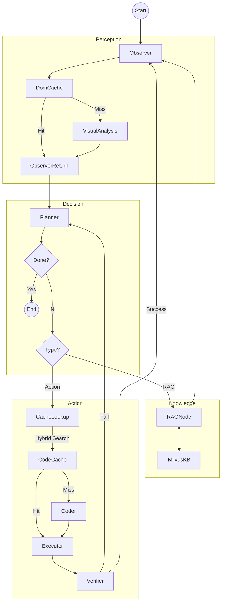

# 🌐 AutoWeb - Intelligent Web Automation Agent (V6)

> 🚀 **V6 Update**: Introduced **Multi-Vector Code Cache**, **Dom Cache**, **Enhanced Planner**, and **Dedicated RAG Node** for robust, efficient, and intelligent web automation.

AutoWeb 是一个基于 **LangGraph** 的多节点协作 AI Agent，能够理解自然语言指令，自动规划、执行复杂的网页操作任务。V6 版本显著提升了执行效率和准确性，通过双层缓存机制（DomCache + CodeCache）实现秒级响应和经验复用。


## ✨ 核心特性 (V6)

| 特性                    | 描述                                                                                      |
| ----------------------- | ----------------------------------------------------------------------------------------- |
| 🧠**多节点协作**        | Observer → DomCache → Planner → CodeCache → Coder → Executor → Verifier 流水线架构        |
| ⚡**双层缓存体系**      | **DomCache (L1)**: 秒级复用页面定位策略；**CodeCache (L2)**: 复用已验证的 Python 动作代码 |
| 🔍**多向量检索**        | CodeCache 采用 Hybrid Search (Goal + URL + Locator + Task) + Weighted Ranker，精准召回    |
| 🛡️**增强型 Planner**    | 具备任务终结感知能力（防止死循环），防御策略误导，支持 RAG 任务路由                       |
| 📚**RAG 知识库**        | 独立的知识库读写节点，支持将爬取数据存入 Milvus 或进行 QA 问答                            |
| 🔄**Command Pattern**   | 节点返回`Command(goto="NextNode")` 实现动态路由                                           |
| 🧑‍💻**Human-in-the-Loop** | 关键操作前暂停，支持人工审批、编辑代码、覆盖验收结果                                      |
| 💾**状态持久化**        | 基于 MemorySaver 的检查点机制，支持断点续传                                               |

## 🏗️ 架构设计 (Architecture)

详细架构说明请参考 [graph_logic_v6.md](./graph_logic_v6.md)。



## 📂 目录结构

```
AutoWeb/
├── main.py                 # 主入口（交互循环 + HITL 处理）
├── config.py               # 全局配置（LLM、Milvus、权重等）
├── core/
│   ├── graph_v2.py         # LangGraph 图构建
│   ├── nodes.py            # 节点实现（Observer/Planner/Coder/Executor/Verifier）
│   └── state_v2.py         # AgentState 类型定义
├── skills/
│   ├── observer.py         # 环境感知（Visual Analysis + DomCache）
│   ├── code_cache.py       # [V6] 多向量代码缓存管理器
│   ├── dom_cache.py        # [V6] DOM 策略缓存管理器
│   ├── tool_rag.py         # RAG 工具封装
│   ├── actor.py            # 代码执行沙箱
│   └── vector_gateway.py   # 向量数据库网关
├── prompts/
│   ├── planner_prompts.py  # [V6] 增强版规划 Prompt
│   ├── action_prompts.py   # Coder Prompt
│   ├── dom_prompts.py      # DOM 分析 Prompt
│   └── rag_prompts.py      # RAG 相关 Prompt
├── rag/
│   ├── milvus_schema.py    # [V6] Milvus Schema 定义
│   ├── retriever_qa.py     # 检索与问答实现
│   └── field_registry.py   # 字段注册表
└── drivers/
    └── drission_driver.py  # 浏览器驱动封装
```

## 🚀 快速开始

### 1. 环境准备

确保已安装 [Milvus](https://milvus.io/) (Docker 或 Standalone) 以及 Python 3.11+。

### 2. 安装依赖

```bash
pip install -r requirements.txt
```

### 3. 配置环境变量

创建 `.env` 文件：

```env
# --- LLM 配置 (支持 OpenAI, DashScope/Qwen, VolcEngine 等) ---
# 示例：使用 DashScope (通义千问)
BAILIAN_API_KEY=sk-xxxxxxxxxxxxxx
BAILIAN_BASE_URL=https://dashscope.aliyuncs.com/compatible-mode/v1
BAILIAN_MODEL_NAME=qwen-plus

# --- Milvus 配置 ---
MILVUS_URI=http://localhost:19530
MILVUS_TOKEN=root:Milvus

# --- Code Cache 配置 (V6) ---
CODE_CACHE_ENABLED=True
CODE_CACHE_WEIGHT_GOAL=0.6
CODE_CACHE_WEIGHT_LOCATOR=0.3
CODE_CACHE_WEIGHT_URL=0.1

# --- Dom Cache 配置 (V6) ---
DOM_CACHE_ENABLED=True
```

### 4. 运行

```bash
python main.py
```

### 5. 使用示例

**场景：爬取 mard.gov.vn 搜索结果并存入知识库**

```
👤 Utils > (启动)
👤 User > 打开 https://www.mard.gov.vn/en/Pages/default.aspx#，搜索 sea，然后爬取搜索到的全部信息存入知识库

🧠 [Planner] 正在制定计划...
   Plan: 1. 在搜索框中输入 "sea" 并执行搜索

💻 [Coder] (Code Cache Miss) 正在编写代码...
⚡ [Executor] 执行代码...
✅ [Verifier] Verification Passed -> 写入 CodeCache

(进入下一轮，页面刷新)

👁️ [Observer] (DomCache Miss) 分析结果页结构...
🧠 [Planner] Plan: 2. 爬取当前页数据并保存

... (中间多轮翻页，CodeCache/DomCache 命中加速) ...

🧠 [Planner] Plan: 5. 将数据存入知识库
📚 [RAG] 执行数据入库 (Milvus)

🧠 [Planner] (检查 finished_steps) 任务已完成
🏁 [End]
```

## 🔧 V6 关键配置说明

在 `config.py` 中可调整核心参数：

- **`CODE_CACHE_THRESHOLD`**: 代码复用相似度阈值 (默认 0.85)。越高越严谨，越低复用率越高但风险增加。
- **`DOM_CACHE_TTL_HOURS`**: DOM 缓存有效期 (默认 168 小时)。
- **`MILVUS_URI`**: 向量数据库地址。

## 📋 待办事项

- [ ] 支持多浏览器实例并行
- [ ] 集成视觉模型（截图理解）
- [ ] 支持更多持久化后端（SQLite/PostgreSQL）
- [ ] 添加 Web UI 控制面板

## 📄 License

MIT License
