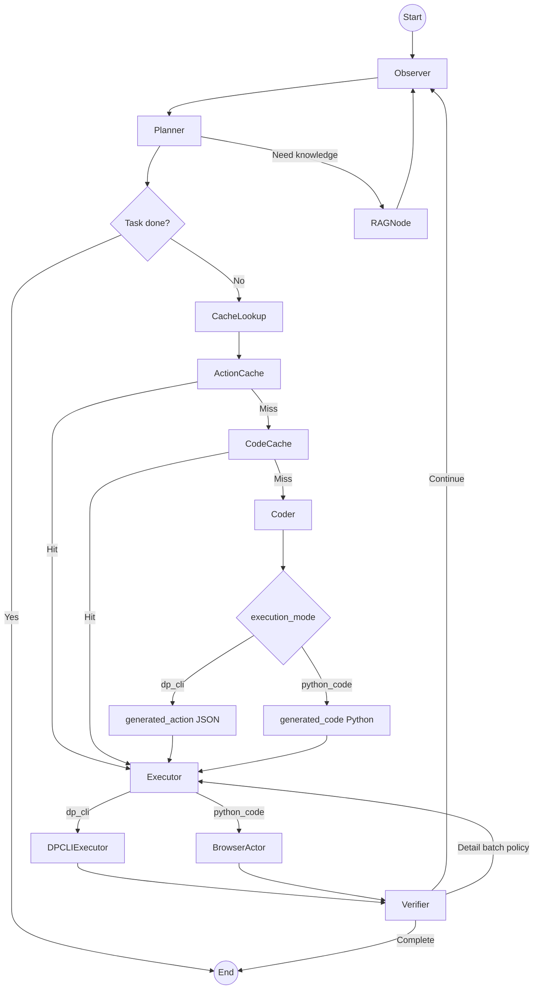

# AutoWeb


AutoWeb 是一个基于 LangGraph 的智能网页自动化 Agent。当前版本在原有 DrissionPage + Python Coder 执行链路之上，新增了 `dp_cli` 结构化动作模式：系统可以继续生成 Python 策略代码，也可以生成可审查、可缓存、可复用的 CLI Action JSON，由 `drissionpage-cli` 执行。

本次更新的重点不是简单替换执行器，而是把 AutoWeb 升级为双轨执行架构：

- `python_code` 模式：保留原有 Coder 生成 Python 代码、Executor 通过 `BrowserActor` 执行的能力。
- `dp_cli` 模式：Coder 生成单步 Action JSON，Executor 通过 `DPCLIExecutor` 调用 `python -m dp_cli` 执行。
- `ActionCache`：在 dp_cli 模式下缓存成功动作，用于替代一部分“重复写代码”的场景。
- `dp_cli snapshot`：可选用 CLI 快照作为 Observer 的轻量观察输入，失败时可回退到原 DOM Observer。
- `batch-detail-extract`：针对“列表页抓详情页”任务，Verifier 可在一次成功提取后继续生成批量详情动作。

## Current Status

当前系统默认保持保守兼容：不开启环境变量时，AutoWeb 仍走原有 Python Coder + CodeCache + BrowserActor 路径。要试用新链路，需要在 `.env` 中显式开启 `DPCLI_ENABLED=True`，并配置本地 `drissionpage-cli` 仓库路径。

## Architecture


```mermaid
graph TD
    Start((Start)) --> Observer
    Observer --> Planner
    Planner --> Done{Task done?}
    Done -- Yes --> End((End))
    Done -- No --> CacheLookup

    Planner -- Need knowledge --> RAGNode
    RAGNode --> Observer

    CacheLookup --> ActionCache
    ActionCache -- Hit --> Executor
    ActionCache -- Miss --> CodeCache
    CodeCache -- Hit --> Executor
    CodeCache -- Miss --> Coder

    Coder --> Mode{execution_mode}
    Mode -- dp_cli --> ActionJSON[generated_action JSON]
    Mode -- python_code --> PythonCode[generated_code Python]

    ActionJSON --> Executor
    PythonCode --> Executor

    Executor -- dp_cli --> DPCLI[DPCLIExecutor]
    Executor -- python_code --> BrowserActor[BrowserActor]

    DPCLI --> Verifier
    BrowserActor --> Verifier
    Verifier -- Continue --> Observer
    Verifier -- Detail batch policy --> Executor
    Verifier -- Complete --> End
```

## Core Features

| Capability | Current implementation |
| --- | --- |
| Multi-node workflow | `Observer -> Planner -> CacheLookup -> Coder -> Executor -> Verifier` |
| Dual execution mode | `python_code` for legacy Python strategies, `dp_cli` for structured CLI actions |
| Human-in-the-loop | Executor 前可人工审查 Python 代码或 Action JSON，Verifier 后可确认结果 |
| DomCache | Observer 阶段缓存页面结构和语义观察 |
| CodeCache | Python Coder 生成代码的历史复用链路 |
| ActionCache | dp_cli 成功动作的轻量 JSON 缓存链路，支持失败命中黑名单 |
| RAG | 通过 Milvus/RAG 为复杂页面任务补充知识 |
| dp_cli snapshot | 可选使用 `snapshot` 作为轻量观察视图 |
| Detail batch policy | 从列表抽取结果继续生成详情页批处理动作 |

## Repository Layout

```text
AutoWeb/
├── main.py                         # CLI 入口、交互循环、HITL 编辑逻辑
├── config.py                       # 环境变量和全局配置
├── core/
│   ├── graph_v2.py                 # LangGraph 图构建
│   ├── nodes.py                    # Observer/Planner/Coder/Executor/Verifier 节点
│   └── state_v2.py                 # AgentState 状态 schema
├── drivers/
│   └── drission_driver.py          # DrissionPage 浏览器单例
├── prompts/
│   ├── coder_prompts.py            # Python Coder prompt
│   └── dpcli_action_prompts.py     # dp_cli Action JSON prompt
├── skills/
│   ├── actor.py                    # Python 策略执行器
│   ├── observer.py                 # DOM 观察和 DomCache
│   ├── code_cache.py               # Python CodeCache
│   ├── action_cache.py             # dp_cli ActionCache
│   ├── dpcli_executor.py           # dp_cli 子进程适配层
│   ├── dpcli_crawl_policy.py       # 详情页批处理动作策略
│   └── vector_gateway.py           # Milvus 封装
├── rag/                            # RAG schema、retriever、QA
├── scripts/
│   └── smoke_dpcli_executor.py     # dp_cli 适配层冒烟脚本
├── test/                           # unittest 测试
├── browser_data/                   # 浏览器运行数据，gitignored
├── logs/                           # 日志，gitignored
└── output/                         # 生成产物和缓存，gitignored
```

## Quick Start

### 1. Install dependencies

```bash
pip install -r requirements.txt
```

如果要试用 `dp_cli` 模式，请先准备本地 `drissionpage-cli` 仓库，并确保该环境能运行：

```bash
python -m dp_cli --help
```

### 2. Configure `.env`

基础 LLM、Milvus、浏览器配置仍沿用原项目设置。下面是本次更新新增或重点相关的配置：

```env
# --- dp_cli structured action mode ---
DPCLI_ENABLED=False
DPCLI_CWD=E:\GitHub\Repositories\drissionpage-cli
DPCLI_PYTHON=python
DPCLI_SESSION=autoweb
DPCLI_HEADLESS=False
DPCLI_TIMEOUT_SECONDS=60
DPCLI_BATCH_TIMEOUT_SECONDS=900

# --- Optional dp_cli observer snapshot ---
DPCLI_OBSERVER_ENABLED=False
DPCLI_OBSERVER_FALLBACK_TO_DOM=True

# --- Optional dp_cli action cache ---
ACTION_CACHE_ENABLED=False
ACTION_CACHE_THRESHOLD=0.75
ACTION_CACHE_STORE_PATH=./output/action_cache.json
```

建议按阶段开启：

1. 先保持 `DPCLI_ENABLED=False`，确认原 Python 链路仍可运行。
2. 设置 `DPCLI_ENABLED=True`，只验证单步动作生成和执行。
3. 再开启 `DPCLI_OBSERVER_ENABLED=True`，验证快照观察质量。
4. 最后开启 `ACTION_CACHE_ENABLED=True`，验证动作缓存复用。

### 3. Run AutoWeb

```bash
python main.py
```

## Execution Modes

### Python Code Mode

这是 AutoWeb 原有主链路。Coder 生成 Python 代码写入 `generated_code`，Executor 调用 `BrowserActor.execute_python_strategy()` 执行。

适合：

- 复杂页面逻辑
- 需要临时计算或多步控制流的任务
- 还没有 dp_cli action 覆盖的动作类型

### dp_cli Mode

dp_cli 模式下，Coder 不再生成 Python 代码，而是生成结构化 Action JSON 写入 `generated_action`。Executor 使用 `DPCLIExecutor` 在 `DPCLI_CWD` 中调用：

```bash
python -m dp_cli ...
```

当前支持的典型动作包括：

- `open`
- `snapshot`
- `find`
- `click`
- `type`
- `expand`
- `list-items`
- `extract`
- `resolve-locator`
- `session.inspect`
- `batch-detail-extract`

HITL 审查时，系统会把动作写入 `temp_action_edit.json`，用户可以在执行前编辑 JSON。

## Cache Strategy

### DomCache

Observer 继续维护页面 DOM 和语义观察缓存，用于减少重复页面理解成本。

### CodeCache

Python CodeCache 仍用于旧的 Python Coder 路径。缓存命中时，Executor 可以直接执行历史 Python 策略。

### ActionCache

ActionCache 是本次更新新增的轻量动作缓存。它面向 dp_cli 模式，缓存结构化动作和任务上下文，默认存储在：

```text
./output/action_cache.json
```

如果某次缓存命中的动作执行失败，Executor 会把该 action id 放入本轮状态的失败黑名单，避免同一轮重复命中同一个坏动作。

## Detail Extraction Flow

对于“从列表页进入详情页并抓取详情”的任务，Verifier 会检查一次成功 `extract` 的结果。如果任务语义需要详情页，并且当前结果还不够完整，系统会通过 `dpcli_crawl_policy.py` 生成后续 `batch-detail-extract` 动作。

这个策略当前只在 dp_cli 路径生效，目的是把“列表 -> 详情页批量抓取”从自由代码生成逐步收敛为可审查的 CLI 批处理动作。

## Important Config

| Variable | Default | Description |
| --- | --- | --- |
| `DPCLI_ENABLED` | `False` | 是否启用 dp_cli 动作生成和执行主路径 |
| `DPCLI_CWD` | `E:\GitHub\Repositories\drissionpage-cli` | 本地 `drissionpage-cli` 仓库路径 |
| `DPCLI_PYTHON` | `python` | 执行 `dp_cli` 的 Python 解释器 |
| `DPCLI_SESSION` | `autoweb` | dp_cli 浏览器会话名 |
| `DPCLI_HEADLESS` | `False` | dp_cli 是否使用 headless |
| `DPCLI_TIMEOUT_SECONDS` | `60` | 单步 dp_cli 动作超时 |
| `DPCLI_BATCH_TIMEOUT_SECONDS` | `900` | 批量动作超时 |
| `DPCLI_OBSERVER_ENABLED` | `False` | Observer 是否优先使用 dp_cli snapshot |
| `DPCLI_OBSERVER_FALLBACK_TO_DOM` | `True` | dp_cli snapshot 失败时是否回退原 DOM Observer |
| `ACTION_CACHE_ENABLED` | `False` | 是否启用 dp_cli ActionCache |
| `ACTION_CACHE_THRESHOLD` | `0.75` | ActionCache 相似度阈值 |
| `ACTION_CACHE_STORE_PATH` | `./output/action_cache.json` | ActionCache JSON 存储路径 |

## Test Commands

```bash
# dp_cli executor, observer projection, action prompt, crawl policy
python -m unittest discover -s test -p "test_dpcli*.py" -v

# dp_cli ActionCache
python -m unittest discover -s test -p "test_action_cache.py" -v

# Optional smoke test for local drissionpage-cli integration
python scripts/smoke_dpcli_executor.py
```

原有测试仍可使用：

```bash
python -m unittest discover -s test -p "test_*.py"
```

注意：部分历史测试依赖 Milvus、pymilvus 或本地模型服务。没有准备这些外部依赖时，建议先运行上面的定向测试。

## Development Notes

- 图节点仍遵循 `Command(goto="...")` 路由风格，不在 `graph_v2.py` 里新增复杂显式条件边。
- `DPCLI_ENABLED=False` 时应保持原行为兼容。
- dp_cli 相关能力优先以小步开关验证，不建议一次性打开 snapshot、ActionCache 和批处理策略。
- 新增动作类型时，应同时更新 `prompts/dpcli_action_prompts.py`、`skills/dpcli_executor.py` 和对应测试。
- 涉及浏览器实例时仍通过 `BrowserDriver` 或 dp_cli session 管理，不绕过现有入口。

## Relationship With drissionpage-cli

AutoWeb 不直接复制 `drissionpage-cli` 的实现，而是通过 `DPCLIExecutor` 做受控子进程适配：

1. AutoWeb 负责规划、观察、缓存、HITL、验证。
2. Coder 在 dp_cli 模式下只输出结构化动作。
3. `drissionpage-cli` 负责把动作落到真实浏览器。
4. 执行结果回写到 `dpcli_result`、`dpcli_snapshot` 和 `execution_result`，供 Verifier 和后续节点使用。

这种边界让 AutoWeb 可以逐步从“生成代码执行”迁移到“生成动作执行”，同时保留旧链路作为回退。

## License

MIT License
