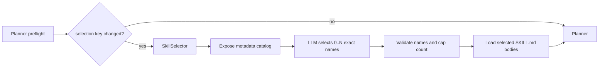

# AutoWeb Agent Skills Architecture

## Objective

把站点知识与执行策略解耦。运行时不得根据域名直接返回预设动作，也不得在模型选择之前读取并注入全部技能正文。

## Skill contract

每个技能使用独立目录：

```text
agent_skills/
└── maoyan-movie/
    └── SKILL.md
```

`SKILL.md` 只允许两个 YAML frontmatter 字段：

```md
---
name: maoyan-movie
description: 描述能力以及应触发的任务和网站。
---

# 正文
```

- `name` 使用小写字母、数字和连字符，且必须与目录名相同。
- `description` 同时说明技能能力与触发场景，是模型选择的唯一发现依据。
- Markdown 正文只写选中后的工作流、页面识别知识和资源使用说明。

## Runtime sequence



选择键包含规范化用户任务、当前域名和技能目录元数据签名。因此：

- 同一任务和域名内不会每轮重复选择。
- 跨域跳转后重新选择目标站技能。
- 修改技能名称或描述后自动使旧选择失效。
- 技能正文修改不会改变触发选择；正文在下次 Planner 使用时由新选择加载。运行中的同域任务若需立即生效，应开始新任务或修改 description。

## State contract

| Field | Meaning |
| --- | --- |
| `skill_selection_key` | 任务、域名和目录元数据指纹 |
| `skill_selection` | 选择原因、无效名称、目录大小和错误审计 |
| `active_skill_names` | 当前实际加载的技能名称 |
| `active_skill_context` | 只包含已选技能正文的 Planner 上下文 |

运行追踪把 `SkillSelector` 记录为正常 LLM 调用，Token 与时长进入模型对比统计。基准事件只保存选择审计和名称，不复制技能正文。

## Safety boundary

技能只提供程序性知识，不能覆盖以下确定性机制：

- 不可逆操作拦截，例如提交订单、付款、投递和发送消息。
- robots、访问频率、域名预算和冷却策略。
- 登录、验证码、扫码和 App 门槛。
- dp_cli 动作 schema、快照引用和可执行目标校验。

这些策略保留在 Python 运行时。任何 `SKILL.md` 与其冲突时均以运行时安全策略为准。

## Benchmark integrity

有效的模型对比必须满足：

1. 三个模型看到完全相同的 `name + description` 目录。
2. `skill_selection_mode` 为 `llm_metadata_then_progressive_body_load`。
3. 关闭跨模型动作、DOM 和代码缓存。
4. 统计 SkillSelector 与 Planner 的全部模型调用。
5. 不存在任务专属 waypoint 或模型调用前的站点动作短路。

旧的 0 Token 站点矩阵只能作为历史适配器执行证据，不能用于比较模型推理能力。
