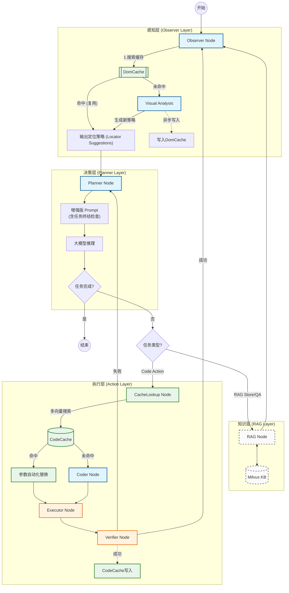

# AutoWeb Agent Architecture (V6)

本文档描述了 AutoWeb V6 的核心架构，集成了 **Code Cache (Multi-Vector)**、**Dom Cache**、**Planner Enhancement** 和 **RAG Node** 等关键组件。

## 1. 核心架构流程图

## 2. 核心组件说明

### 2.1 感知层 (Observer Layer)

- **DomCache (Level 1 Cache)**:
  - **作用**: 秒级复用页面分析结果。
  - **机制**: 当 URL 和 DOM 结构相似时，直接返回之前的 `locator_suggestions`，跳过耗时的视觉模型调用。
  - **失效策略**: 若后续步骤执行失败，自动失效对应的 DomCache 条目。

### 2.2 决策层 (Planner Layer)

- **Planner Node**:
  - **增强点**: 引入了**最高优先级**的"任务终结检查"。
  - **防误导**: 即使 Observer (DomCache) 提供了可操作建议（如翻页按钮），Planner 也会先检查 `finished_steps`，确认数据是否已爬完，防止死循环。
  - **上下文**: 接收 `last_verification_result`，确切知道上一步是否成功。

### 2.3 执行层 (Action Layer)

- **CodeCache (Level 2 Cache)**:
  - **作用**: 复用已验证的 Python 操作代码。
  - **机制**: 采用 **Multi-Vector Hybrid Search** (Goal + Method + Context) 提高检索准确率。
  - **参数替换**: 支持将代码中的旧参数（如搜索词 "sea"）自动替换为新参数，零 Token 消耗生成新代码。
- **Coder Node**:
  - **作用**: 生成执行代码。
  - **机制**: 基于 Planner 的指令和 Observer 提供的定位策略，编写稳健的 Playwright/Selenium 代码。
  - **容错**: 具备自我修正机制，若 Executor 报错，可根据错误信息重新生成。
- **Executor Node**:
  - **作用**: 安全执行代码。
  - **机制**: 在沙箱或受控环境中运行代码，管理浏览器上下文，捕获运行时错误。
- **Verifier**:
  - **作用**: 验证执行结果是否符合预期。
  - **逻辑**: 成功则写入 CodeCache 并返回 Observer；失败则通知 Planner 重试或调整计划。

### 2.4 知识层 (RAG Layer)

- **RAG Node**:
  - **作用**: 独立的知识库读写单元，负责将爬取的数据存入 Milvus 或进行 QA 问答。
  - **隔离**: 与业务执行逻辑分离，保持 Executor 纯净。

## 3. 关键路径示例

**场景：用户要求"爬取 mard.gov.vn 搜索结果并存入知识库"**

1. **Observer**: 首次访问，DomCache 未命中 -> 调用视觉模型分析 -> 生成定位策略。
2. **Planner**: 生成计划 "输入关键字搜索"。
3. **Action**: CodeCache 未命中 -> Coder 写代码 -> Executor执行 -> Verifier 验证成功。
4. **Observer**: 再次分析（结果页），**DomCache 命中**（复用定位策略）。
5. **Planner**: 收到策略，生成 "爬取当前页数据"。
6. **Action**: Coder 写代码 -> Executor 爬取 -> Verifier 验证成功 -> 数据暂存。
7. **Planner**: 生成 "存入知识库"。
8. **RAG Node**: 将数据存入 Milvus。
9. **Planner**: 检查 `finished_steps`，发现所有子任务已完成 -> **结束任务**。
